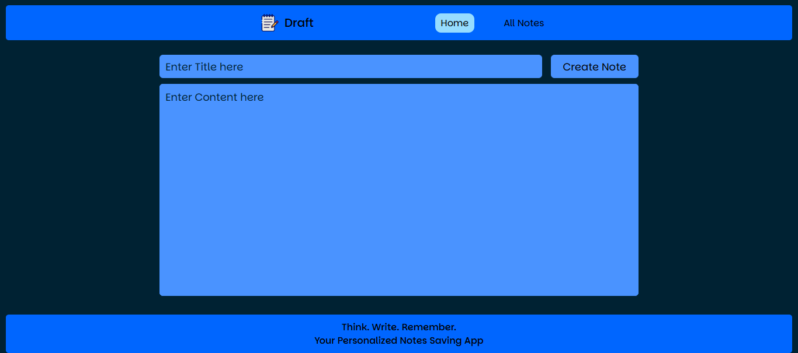
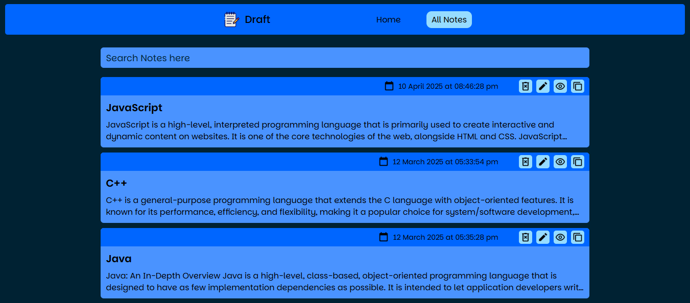

# Draft - Notes Saving App
## 🚀 Overview
A simple and efficient notes app built with **React JS** that allows users to add, edit, delete, and search through their notes. The application leverages **Redux Toolkit** for managing the app's state, and it saves the notes in the browser's `localStorage`, ensuring that the notes persist even after the page reloads.

 

## 🚀 Screenshots

  

 

## 🚀 Features
- **Create, edit, and delete notes:** Users can easily manage their notes with intuitive UI controls.
- **Search notes:** Users can search through their notes quickly by typing keywords. The app filters and displays matching notes in real-time.
- **Persistent storage with localStorage:** All notes are saved in the browser's `localStorage`, ensuring data is not lost between sessions.
- **State management with Redux Toolkit:** Efficient and scalable state management with Redux Toolkit.

 

## 🚀 Tech Stack
- **Frontend:** React JS
- **Styling:** Vanilla CSS
- **Storage:** localStorage

 

## 🚀 Deployment
The app is deployed on <b>Vercel</b> and can be accessed via:
 
https://draft-notes-app.vercel.app/

 

## 🚀 Contact
- LinkedIn: www.linkedin.com/in/ibadhussain